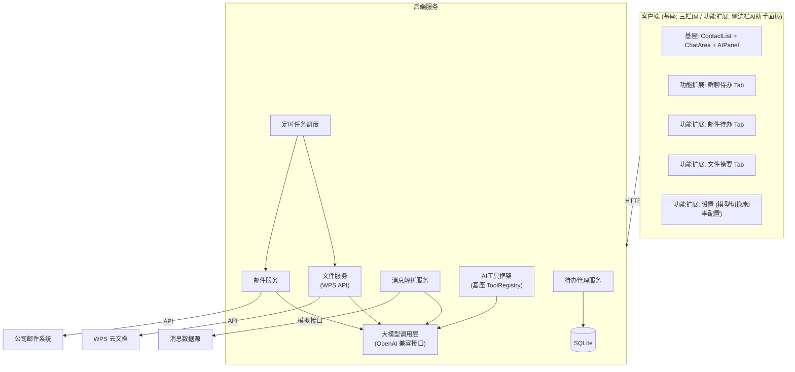
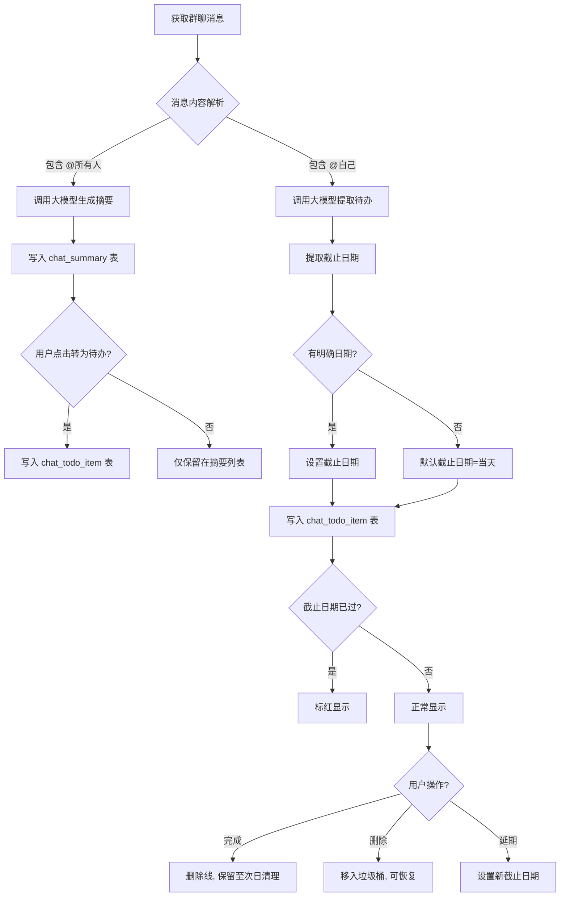
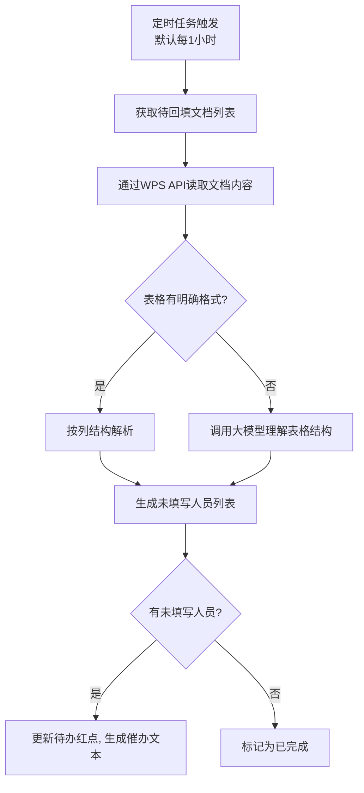
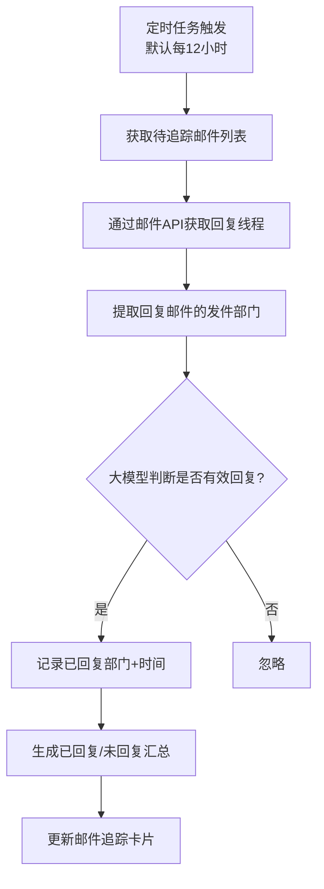
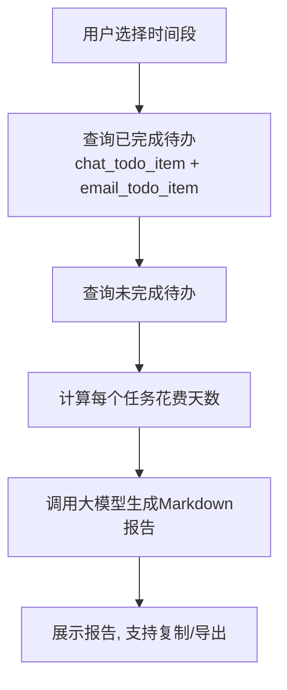

# 内部IM智能助手 - 功能实现细节

> 基于 DeepSeek / Qwen 大模型的企业内部办公辅助系统
>
> 版本: v2.0 | 日期: 2026-07-12

---

## 项目概述

本项目在 [AI 办公助手 Demo](./ai-office-assistant-demo.md)（聊天软件基座）之上，围绕**群聊消息、文件、邮件**三大模块，提供待办管理、文件摘要、回填检测、邮件回复追踪、工作报告自动生成等办公辅助能力。

> 聊天软件基座的技术选型、项目结构、数据库设计、API 设计、AI 工具注册框架、前端设计等，请参见 **[AI 办公助手 Demo](./ai-office-assistant-demo.md)**。

---

## 1. 项目背景与目标

### 1.1 业务背景

公司内部使用自研 IM 系统进行日常办公沟通，功能类似钉钉。随着业务规模扩大，员工每天面临大量群聊消息、文件协作和邮件往来，存在以下核心问题：

- **消息跟进困难**：群聊中 @所有人 或 @自己的消息容易被淹没，缺乏有效的任务追踪机制
- **文件协作盲区**：发出需要回填的 WPS 云文档后，难以实时掌握谁已填写、谁未填写
- **邮件回复追踪缺失**：发出需要跨部门回复的邮件后，无法自动汇总回复进度
- **工作汇报成本高**：已完成任务分散在群聊和邮件中，每周/月手动整理报告耗时耗力

### 1.2 项目目标

在聊天基座之上，通过**侧边栏 AI 助手面板**（点击侧边栏唤醒）提供**群聊消息、文件、邮件**三大模块的办公辅助能力，包括消息待办管理、文件摘要生成、回填检测、邮件回复追踪、工作报告自动生成等。用户可通过文字描述或预制按键下达指令，结果反映在侧边栏面板中。

### 1.3 用户与使用场景

- **目标用户**：公司内部团队使用（Demo 阶段为单用户，不考虑多租户）
- **数据隔离**：每个人的待办、文件、邮件数据严格隔离，通过 IM 系统的登录态获取用户身份

### 1.4 信息分类总览

| | 群聊消息 | 文件（WPS 云文档等） | 邮件 |
|--|---------|-------------------|------|
| **自己发出的** | 无需处理 | 回填检测（谁未填写） | 回复追踪（已回复/未回复部门） |
| **自己收到的** | @所有人→摘要；@自己→待办 | 文件摘要（金额、规则、考核等） | 邮件待办管理 |

## 2. 功能需求详细说明

### 2.1 模块 A：消息待办（群聊 + 私聊）

消息待办 Tab 分为两个区域：

**上半区：消息摘要（@所有人）**

助手监听（或导入）群聊消息，检测其中包含"@所有人"的消息，对每条消息调用大模型生成简要摘要。

- **摘要内容**：核心事项 + 截止日期（如有）
- **原消息跳转**：每条摘要附带原消息的位置链接
- **转为待办**：用户可点击"转为待办"按钮，将该条摘要自动转为待办条目，进入下半区待办列表

**下半区：待办（群聊 @自己 + 私聊）**

以下两类消息自动纳入待办：

1. **群聊 @自己的消息**：检测单独 @自己的消息，调用大模型提取待办事项
2. **私聊需办消息**：检测私聊中具有强烈目标性的消息（对方明确提出请求、任务、询问等），且当前用户已正面回复（确认/答应/接受任务等）

每条待办包含：待办内容摘要、来源（群组名称或私聊对象）、截止日期、创建时间、状态。

- **消息引用**：每条待办附带原始消息的引用（source_id），点击可跳转到对应聊天位置查看完整上下文
- **私聊识别逻辑**：大模型判断对方消息是否包含明确目标/请求 + 当前用户的回复是否为正面确认
- **典型场景**：
  - 群聊 @自己："@张三 周五前提交周报" → 自动生成待办
  - 私聊：对方"明天上午10点前把接口文档发给我" → 我方"好的，我整理一下" → 自动生成待办"【给李四发送接口文档】"
  - 私聊：对方"这周五前帮忙review一下PR" → 我方"没问题" → 自动生成待办"【Review PR（来源：王五）】"

> 私聊待办仅当用户正面回复时才生成，未回复的消息不自动纳入（避免将普通聊天误判为待办）。

**待办状态管理**：

- **完成标记**：显示删除线样式，保留到次日自动清理
- **删除→垃圾桶**：支持恢复操作，垃圾桶次日自动清零
- **延期办理**：设置新的截止日期
- **超期标红**：截止日期已过且未完成的任务自动标红
- **消息唯一性**：每条消息（source_id）只会生成一个待办

### 2.2 模块 B：文件摘要

用户将 WPS 云文档的 URL 发送给助手，大模型读取文档后提取：文档主题、涉及金额、关键规则、考核标准、考核部门等结构化信息。

### 2.3 模块 C：文件回填检测

定时任务（默认每 1 小时）通过 WPS API 获取文档最新内容，判断每行人员是否已填写（有明确格式按列解析，无明确格式调用大模型），生成未填写人员名单和催办文本。

### 2.4 模块 D：邮件待办

通过公司邮件系统 API 获取邮件，调用大模型判断是否包含需要处理的事项，生成待办条目。邮件待办与群聊待办分开展示。

### 2.5 模块 E：邮件回复追踪

定时任务（默认每半天）检索邮件回复线程，汇总已回复/未回复部门，以卡片形式展示。

### 2.6 模块 F：工作报告生成

用户选择时间段内的已完成待办，大模型自动汇总生成 Markdown 格式工作报告，含花费天数、未完成任务、工作计划等。

## 3. 优先级与迭代计划

| 优先级 | 功能模块 | 说明 |
|-------|---------|------|
| P0 | 消息待办 | @所有人 摘要 + @自己 群聊待办 + 私聊待办（目标识别+正面回复判定） + 垃圾桶恢复 + 超期标红 |
| P0 | 邮件待办 | 邮件 API 对接 + 待办生成（独立表结构） + 垃圾桶恢复 |
| P0 | 邮件回复追踪 | 自动检测已回复/未回复部门并汇总 |
| P0 | 文件摘要 | 通过 WPS 云文档 URL 读取并生成结构化摘要 |
| P1 | 文件回填检测 | 定时检测云文档填写状态，依赖 WPS API 和定时任务 |
| P1 | 工作报告生成 | 基于已完成待办自动汇总，需要 P0 功能先上线 |

## 4. 系统架构设计

### 4.1 整体架构



*Figure 1: 系统整体架构图*

### 4.2 客户端方案

- **基座（当前）**：三栏 IM 界面（ContactList + ChatArea + AIPanel）
- **功能扩展**：在基座侧边栏基础上扩展 AI 助手面板，Tab 切换（群聊待办 / 邮件待办 / 文件摘要），支持文字描述和预制按键两种交互方式

### 4.3 技术选型

| 组件 | 推荐方案 | 备选方案 |
|------|---------|---------|
| 后端框架 | Python (FastAPI) + SQLAlchemy | Java Spring Boot |
| 前端框架 | Vue 3 + Vite + Axios + Marked | React + Ant Design |
| 数据库 | SQLite (Demo) | PostgreSQL / MySQL (生产) |
| 定时任务 | APScheduler / Celery Beat | Spring @Scheduled |
| 大模型调用 | OpenAI 兼容 SDK（DeepSeek/Qwen） | HTTP 直接调用 API |
| WPS 接入 | WPS 开放平台 API | - |
| 邮件接入 | 公司邮件系统 API | IMAP/SMTP |

## 5. 数据模型设计（新增表）

> 基座的 4 张表（users, groups, group_members, messages）保持不变，以下为功能扩展新增的 6 张表。

### @所有人 消息摘要表 (chat_summary)

| 字段 | 类型 | 说明 |
|------|------|------|
| id | UUID | 主键 |
| user_id | String | 用户标识（来自 IM 登录态） |
| source_id | String | 原始消息 ID（用于跳转到原消息） |
| group_name | String | 来源群组名称 |
| content | Text | 消息摘要（大模型生成） |
| original_message | Text | 原始消息内容 |
| created_at | Datetime | 创建时间 |

### 群聊待办事项表 (chat_todo_item)

| 字段 | 类型 | 说明 |
|------|------|------|
| id | UUID | 主键 |
| user_id | String | 用户标识 |
| source_id | String | 原始消息 ID |
| group_name | String | 来源群组名称 |
| content | Text | 待办内容摘要（大模型生成） |
| deadline | Date | 截止日期 |
| status | Enum | pending / completed / overdue |
| completed_at | Datetime | 完成时间 |
| created_at | Datetime | 创建时间 |
| updated_at | Datetime | 更新时间 |
| expire_at | Datetime | 自动清理时间 |

### 邮件待办事项表 (email_todo_item)

| 字段 | 类型 | 说明 |
|------|------|------|
| id | UUID | 主键 |
| user_id | String | 用户标识 |
| source_id | String | 原始邮件 ID |
| subject | String | 邮件主题 |
| sender | String | 发件人 |
| content | Text | 待办内容摘要 |
| deadline | Date | 截止日期 |
| status | Enum | pending / completed / overdue |
| completed_at | Datetime | 完成时间 |
| created_at | Datetime | 创建时间 |
| updated_at | Datetime | 更新时间 |
| expire_at | Datetime | 自动清理时间 |

### 文件回填追踪表 (file_tracker)

| 字段 | 类型 | 说明 |
|------|------|------|
| id | UUID | 主键 |
| user_id | String | 用户标识 |
| file_url | String | WPS 云文档 URL |
| file_name | String | 文件名称 |
| status | Enum | tracking / completed / cancelled |
| unfilled_users | String | 未填写人员列表，`\|` 分隔 |
| last_checked_at | Datetime | 上次检测时间 |
| check_interval_min | Int | 检测间隔（分钟），默认 60 |
| created_at | Datetime | 创建时间 |

### 邮件回复追踪表 (email_tracker)

| 字段 | 类型 | 说明 |
|------|------|------|
| id | UUID | 主键 |
| user_id | String | 用户标识 |
| email_id | String | 原始邮件 ID |
| subject | String | 邮件主题 |
| sent_at | Datetime | 发出时间 |
| replied_depts | String | 已回复部门，`\|` 分隔 |
| unreplied_depts | String | 未回复部门列表，`\|` 分隔 |
| status | Enum | tracking / completed / cancelled |
| check_interval_hours | Int | 检测间隔（小时），默认 12 |
| last_checked_at | Datetime | 上次检测时间 |
| created_at | Datetime | 创建时间 |

### 用户设置表 (user_settings)

| 字段 | 类型 | 说明 |
|------|------|------|
| user_id | String | 主键 |
| model_provider | Enum | deepseek / qwen |
| file_check_interval_min | Int | 文件检测间隔，默认 60 |
| email_check_interval_hours | Int | 邮件检测间隔，默认 12 |
| updated_at | Datetime | 更新时间 |

## 6. 调用逻辑与核心流程

### 6.1 大模型调用场景

| 场景 | 输入 | 输出 | 调用频率 |
|------|------|------|---------|
| @所有人 消息摘要 | 群聊消息原文 | 简要摘要（核心事项 + 截止日期） | 每条 @所有人 消息一次 |
| @自己 待办提取 | 群聊消息原文 | 结构化待办（内容摘要、截止日期） | 每条 @自己 消息一次 |
| 私聊待办提取 | 私聊对话（对方消息+我方回复） | 结构化待办（任务内容、截止日期）+ 是否正面回复判定 | 每轮私聊对话一次 |
| 邮件待办提取 | 邮件原文 | 结构化待办（内容摘要、截止日期） | 每封需处理邮件一次 |
| 文件摘要生成 | 文档文本内容 | 结构化摘要（金额、规则、考核部门等） | 用户触发 |
| 回填状态判断 | 表格数据 | 人员列表 + 各自填写状态 | 定时任务（每 1h） |
| 邮件回复判断 | 邮件原文 | 是否需要回复 + 回复部门提取 | 每次新邮件 / 定时 |
| 工作报告生成 | 已完成待办列表 | Markdown 格式报告 | 用户触发 |

### 6.2 群聊消息处理流程



*Figure 2: 群聊消息处理流程*

### 6.3 文件回填检测流程



*Figure 3: 文件回填检测流程*

### 6.4 邮件回复追踪流程



*Figure 4: 邮件回复追踪流程*

### 6.5 工作报告生成流程



*Figure 5: 工作报告生成流程*

## 7. 大模型 Prompt 设计要点

### 7.1 基座 System Prompt

```text
你是一个智能办公助手，当前正在为用户「{user_name}」服务。

你可以通过调用工具来帮助用户：
1. 读取聊天记录：了解用户与同事的沟通上下文
2. 发送消息：替用户向联系人或群组发送消息
3. 获取文件内容：查看聊天中分享的 markdown 文件

原则：
- 用户提到的联系人姓名可能是简称，调用工具时用 peer_name 模糊匹配即可
- 发送消息前确认内容，如果是用户明确要求的指令可以直接发送
- 回答简洁，不要过度解释
```

### 7.2 功能扩展 Prompt 模板

**@所有人 消息摘要**

```text
你是一个办公助手。请对以下 @所有人的群聊消息生成简要摘要，要求：
1. 提取核心事项（做什么）
2. 提取截止日期（如有，格式为 YYYY-MM-DD）
3. 摘要尽量简洁，不超过 50 字
4. 输出 JSON 格式：{"summary": "...", "deadline": "YYYY-MM-DD或null"}

消息内容：{message_content}
```

**@自己 消息待办提取**

```text
你是一个办公助手。请对以下 @当前用户 的群聊消息提取待办信息，要求：
1. 提取待办事项核心内容
2. 提取截止日期（如有，格式为 YYYY-MM-DD）
3. 输出 JSON 格式：{"content": "...", "deadline": "YYYY-MM-DD或null"}

消息内容：{message_content}
```

**私聊待办提取**

```text
你是一个办公助手。请分析以下私聊对话，判断是否需要为当前用户生成待办事项。

判断条件（必须同时满足）：
1. 对方消息中包含明确的请求、任务分配或目标（如"帮忙..."、"请..."、"...前完成"等）
2. 当前用户的回复为正面确认（如"好的"、"没问题"、"收到"、"我整理一下"等）

如果满足条件，提取待办信息；如果不满足（对方只是闲聊、用户未正面回复、用户拒绝了请求），则不生成待办。

输出 JSON 格式：
{"should_create_todo": true/false, "content": "待办内容摘要", "deadline": "YYYY-MM-DD或null", "peer_name": "对方用户名"}

对方消息：{peer_message}
当前用户回复：{user_reply}
```

**邮件待办提取**

```text
你是一个办公助手。请对以下邮件判断是否包含需要处理的事项，要求：
1. 判断是否需要当前用户采取行动
2. 如需行动，提取待办内容和截止日期
3. 输出 JSON 格式：{"action_required": true/false, "content": "...", "deadline": "YYYY-MM-DD或null"}

邮件内容：{email_content}
```

**文件摘要**

```text
你是一个文件分析助手。请阅读以下文档内容，提取关键信息并以结构化方式输出：
1. 文档主题
2. 涉及金额（如有）
3. 关键规则与要求
4. 扣分/考核标准
5. 考核部门
6. 主办部门
7. 其他需要关注的重要信息
输出 JSON 格式：{"title": "...", "amounts": [...], "rules": [...], ...}

文档内容：{file_content}
```

**回填状态判断（无明确格式时）**

```text
你是一个数据表格分析助手。请分析以下表格内容，识别其中的人员列表以及每个人的填写完成情况。

已知需要填写的人员名单：{expected_users}

请输出 JSON 格式：{
  "filled": ["张三", "李四"],
  "unfilled": ["王五", "赵六"],
  "format_description": "表格结构简述"
}

表格内容：{table_content}
```

**工作报告**

```text
你是一个工作汇报助手。请根据以下已完成和未完成的任务列表，生成一份结构化的工作报告（Markdown 格式）。

要求：
1. 按完成时间倒序排列
2. 每个任务标注花费天数（完成时间 - 创建时间）
3. 汇总未完成任务，按紧急程度排序
4. 生成下阶段工作建议

已完成任务：{completed_tasks}
未完成任务：{pending_tasks}
```

## 8. 注意事项与风险

### 数据安全

- 群聊消息和邮件内容可能包含敏感信息，调用大模型前需进行**数据脱敏**处理
- 大模型 API 调用建议走公司内部代理或私有化部署，避免数据外泄

### 大模型准确性

- 截止日期提取可能出现误判，建议增加**人工确认环节**或设置置信度阈值
- 回填状态判断依赖大模型对表格的理解能力，需设计**兜底策略**

### 外部依赖

- **WPS API**：需确认接口权限、调用频率限制、文档格式支持范围
- **邮件系统 API**：需确认 API 文档、认证方式、是否支持线程回复查询
- **大模型 API**：稳定性、响应延迟、Token 限制需提前测试

### 性能考量

- 定时任务需考虑**并发控制**，避免短时间内大量 API 调用
- 大模型调用存在响应延迟（通常 2-10 秒），UI 需设计 Loading 状态

### 数据存储规范

- 数据库中列表类型数据统一使用 `|` 分隔的字符串存储，Service 层负责解析/拼接

## 9. 工作量评估

| 模块 | 工作内容 | 预估工时 | 依赖 |
|------|---------|---------|------|
| **基础设施搭建** | 数据库新增表 + 定时任务框架 + 大模型 SDK 升级 | 3-5 天 | 聊天基座 |
| **消息待办** | 消息模拟接口 + @所有人 摘要 + @自己 群聊待办 + 私聊待办（目标识别+正面回复判定） + 垃圾桶/恢复 + 超期判定 + 消息引用 + 前端双区 Tab | 6-8 天 | 基础设施 |
| **邮件待办** | 邮件 API 对接 + 待办生成 + 前端 Tab | 4-6 天 | 基础设施 + 邮件 API |
| **邮件回复追踪** | 回复线程查询 + 大模型判断 + 部门提取 + 汇总展示 | 4-6 天 | 邮件待办 |
| **文件摘要** | WPS API 对接 + 文档读取 + 大模型摘要 + 结构化展示 | 3-5 天 | 基础设施 + WPS API |
| **文件回填检测** | 表格解析 + 大模型兜底 + 定时任务 + 催办文本 | 4-6 天 | 文件摘要 |
| **工作报告生成** | 时间段选择 + 待办查询 + 天数计算 + 大模型报告 | 2-3 天 | 群聊待办 + 邮件待办 |
| **客户端 UI** | 侧边栏 AI 助手面板扩展 + Tab 切换 + 预制按键 + 设置页 | 5-7 天 | 无 |
| **联调与测试** | 前后端联调 + Prompt 调优 + Bug 修复 | 3-5 天 | 所有模块 |

> **总计预估**：约 33-50 人天（1.5-2.5 个月），按 1 人全职计算。如前后端分工（2 人），可压缩至 3-5 周。

### 关键里程碑

| 里程碑 | 交付内容 | 预估时间 |
|-------|---------|---------|
| M1: 基础框架就绪 | 数据库新增表 + 定时任务框架 + 大模型 SDK 升级 | 第 1 周 |
| M2: 核心功能 Demo | 群聊待办 + 邮件待办 + 文件摘要可用 | 第 2-3 周 |
| M3: 追踪功能上线 | 邮件回复追踪 + 文件回填检测 + 定时任务 | 第 4-5 周 |
| M4: 完整 Demo | 工作报告生成 + UI 优化 + 联调测试 | 第 6 周 |

## 10. 具体实现步骤

### Step 1: 基础设施升级（第 1 周）

1. 在基座的 SQLite 数据库基础上新增 6 张表
2. 集成定时任务框架（APScheduler）
3. 升级大模型 SDK，支持 DeepSeek / Qwen 模型切换
4. 编写单元测试，验证大模型调用通路

### Step 2: 消息待办（第 2 周）

1. 编写消息模拟接口（参照钉钉消息格式，支持 @所有人、@用户、私聊对话）
2. 实现消息解析服务：正则提取 @信息 + 大模型摘要/待办生成
3. @所有人 消息写入 chat_summary 表，@自己 消息写入 chat_todo_item 表
4. 实现私聊待办识别：大模型判断对方消息目标性 + 我方回复正面性，满足条件时写入 chat_todo_item 表（附带私聊 source_id 引用）
5. 实现截止日期提取逻辑（优先大模型提取 + 正则兜底）
6. 实现待办 CRUD API（创建、查询、完成、延期、删除进垃圾桶、恢复、source_id 唯一约束）
7. 实现超期检测 + 垃圾桶次日清零逻辑（定时任务每天凌晨扫描）
8. 前端：消息待办 Tab 页面（上半区消息摘要 + 下半区待办列表，均支持点击跳转原消息）

### Step 3: 邮件待办 + 邮件回复追踪（第 3 周）

1. 对接公司邮件系统 API
2. 实现邮件待办生成逻辑，写入 email_todo_item 独立表
3. 前端：邮件待办 Tab 页面
4. 实现邮件回复追踪：标记需跟踪 → 定时检测 → 已回复/未回复汇总
5. 前端：回复追踪卡片

### Step 4: 文件摘要 + 回填检测（第 4 周）

1. 对接 WPS 开放平台 API
2. 实现文件摘要生成服务
3. 前端：文件摘要 Tab
4. 实现文件回填标记 + 定时回填检测 + 催办文本生成

### Step 5: 工作报告 + 客户端优化（第 5-6 周）

1. 实现工作报告生成（时间段选择 → 待办查询 → 天数计算 → 大模型汇总）
2. 前端：报告展示页面
3. 客户端交互优化：侧边栏 AI 面板交互（文字描述 + 预制按键）、展开/收起动画
4. 设置页面：模型切换、检测频率配置
5. 全局联调、Prompt 调优

---

*内部IM智能助手 - 功能实现细节 v2.0 | 2026-07-12*
