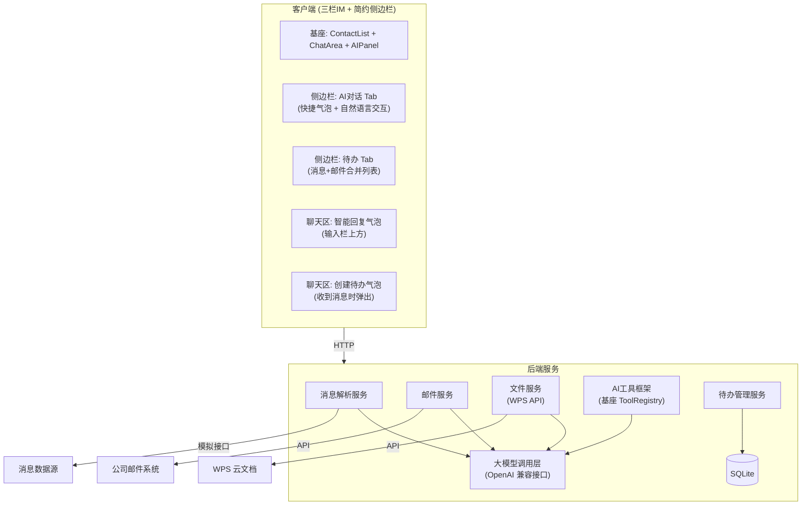
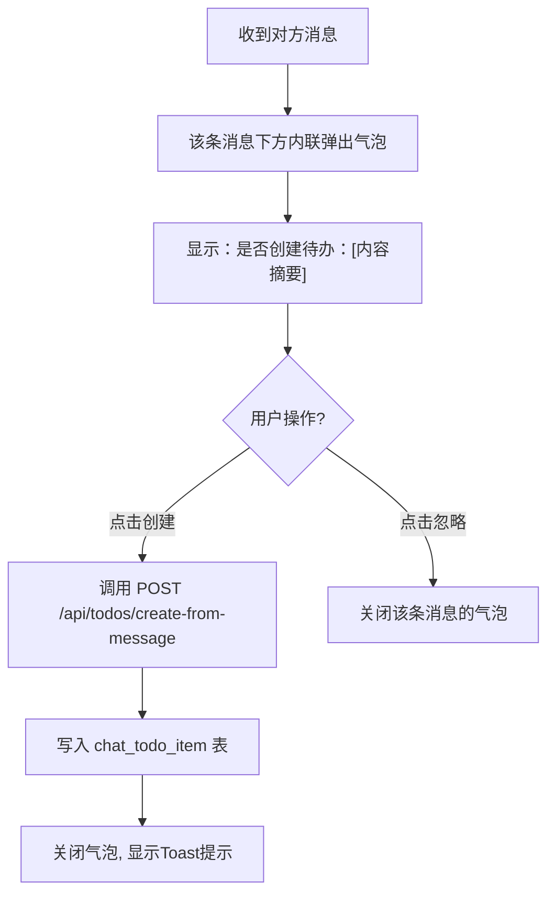
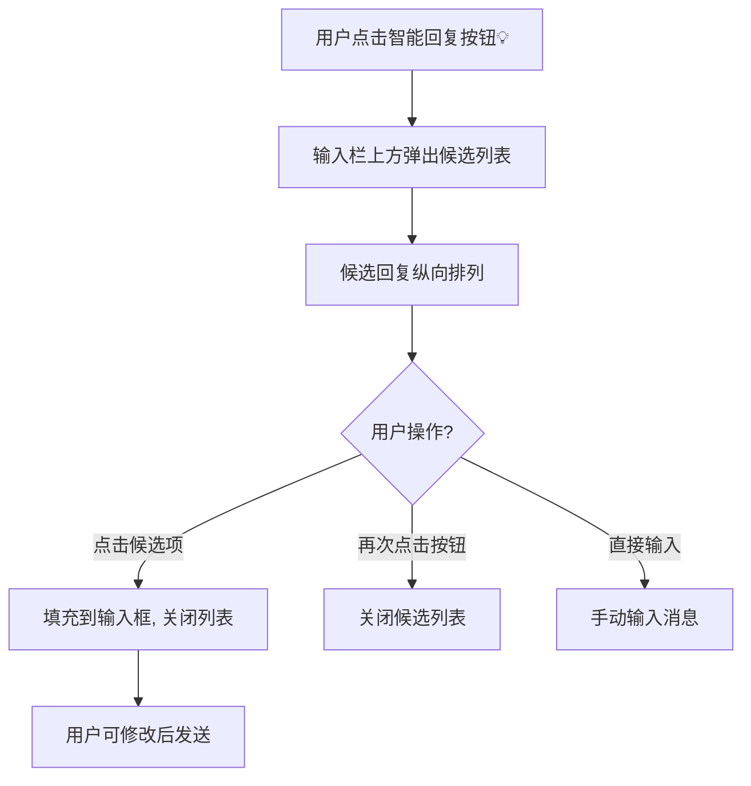
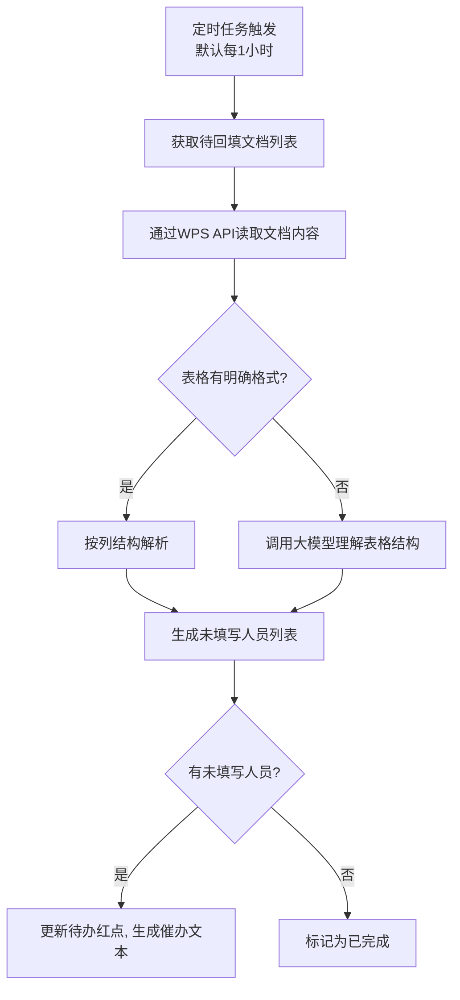
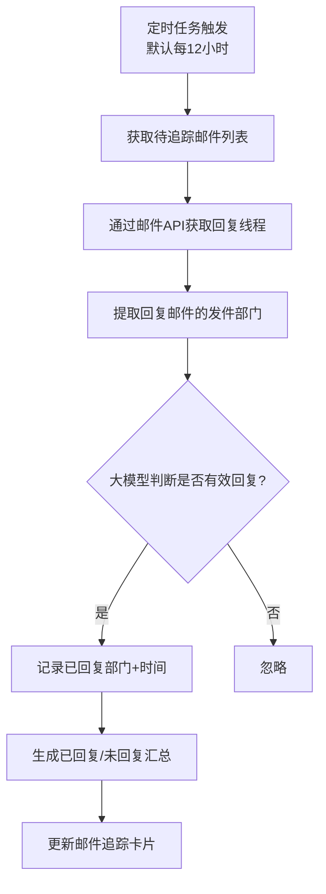

# 内部IM智能助手 - 功能实现细节

> 基于 DeepSeek / Qwen 大模型的企业内部办公辅助系统
>
> 版本: v3.3 | 日期: 2026-07-21

---

## 项目概述

本项目在 [AI 办公助手 Demo](./ai-office-assistant-demo.md)（聊天软件基座）之上，围绕**群聊消息、文件、邮件**三大模块，提供待办管理、文件摘要、回填检测、邮件回复追踪、工作报告自动生成等办公辅助能力。

> 聊天软件基座的技术选型、项目结构、数据库设计、API 设计、AI 工具注册框架、前端设计等，请参见 **[AI 办公助手 Demo](./ai-office-assistant-demo.md)**。

---

## 实现状态总览

> 以下状态基于前后端代码检查 + 用户描述综合判定。状态标签：✅ 已实现 | ⚠️ 实现差异/部分实现 | ❌ 未实现 | 🔴 新增需求

| # | 功能项 | 文档位置 | 状态 | 后端 | 前端 | 问题描述 | 决策结果 |
|---|--------|---------|------|------|------|---------|---------|
| 1 | 快捷提示气泡 | [1.2](#sec-1.2) / [2.1](#sec-2.1) | ✅ | N/A | 已放开注释并优化 ✅ | `quickBubbles` 注释已放开，展示 5 个 AI 功能气泡（总结文件/工作报告/文本润色/撰写邮件/提取信息） |  |
| 2 | 消息手动创建待办入口 | [2.2](#sec-2.2) | ✅ | `create-from-message` 接口存在 ✅ | 右键菜单已加入 ✅ | ChatArea 右键菜单新增"加入待办"项，调用 `createFromMessage` API 创建待办 |  |
| 3 | 工作报告生成 | [2.5](#sec-2.5) | ⚠️ | `/api/reports/work-report` ✅ | 快捷气泡已放开 ✅ | 气泡入口已恢复，但 `glm_ai.py` 的 `build_registry()` 仍未注册 `generate_work_report` 和 `generate_daily_digest` 工具 |  |
| 4 | <span style="color:red">**🔴 已完成待办查看**</span> | [2.2.1](#sec-2.2.1) | <span style="color:red">**🔴 新增需求**</span> | 后端支持 `status=completed` 查询 ✅ | ❌ 前端无入口 | 待办 Tab 新增"已完成"按钮，点击后弹出时间区间选择器，查询该区间内 `status=completed` 的待办列表并展示 |  |
| 5 | 待办点击跳转原消息/邮件 | [2.2](#sec-2.2) | ✅ | `contact_id` 字段已加入 ✅ | 跳转逻辑已实现 ✅ | 聊天待办点击跳转到对应消息（自动切换联系人+高亮闪烁3秒），邮件待办点击弹出预览弹窗 |  |
| 6 | AI 助手浮动按钮 | [2.9](#sec-2.9) | ✅ | N/A | 已实现 ✅ | 可拖动、贴边隐藏、点击唤起 AI 面板，简约时尚风格（白底蓝色SVG图标） |  |
| 7 | 邮件扫描生成待办 | [2.8.4](#sec-2.8.4) | ✅ | `rescan-emails` 接口已新增 ✅ | "扫描邮件"按钮已加入 ✅ | 候选待办区新增"扫描邮件"按钮，先重置扫描记录再触发扫描，可重新扫描所有邮件生成候选 |  |

---

## 1. 项目背景与目标

### 1.1 业务背景

公司内部使用自研 IM 系统进行日常办公沟通，功能类似钉钉。随着业务规模扩大，员工每天面临大量群聊消息、文件协作和邮件往来，存在以下核心问题：

- **消息跟进困难**：群聊中 @所有人 或 @自己的消息容易被淹没，缺乏有效的任务追踪机制
- **文件协作盲区**：发出需要回填的 WPS 云文档后，难以实时掌握谁已填写、谁未填写
- **邮件回复追踪缺失**：发出需要跨部门回复的邮件后，无法自动汇总回复进度
- **工作汇报成本高**：已完成任务分散在群聊和邮件中，每周/月手动整理报告耗时耗力

### <a id="sec-1.2"></a>1.2 项目目标

在聊天基座之上，通过**侧边栏 AI 助手面板**提供简洁的办公辅助能力。侧边栏仅保留 **AI对话** 和 **待办** 两个 Tab：

- **AI对话**：统一的自然语言交互入口，文件摘要、工作报告等功能通过对话完成（如"@文件名 总结一下"、"帮我生成本周工作报告"）。初始状态下输入栏上方纵向排列快捷提示气泡，点击自动填充指令；用户发送首条消息后气泡自动隐藏。提供"新对话"按钮，点击后清空聊天记录并重新展示提示气泡。
  > ✅ **[v3.3 已实现]** 快捷提示气泡功能：`AIPanel.vue` 的 `quickBubbles` 注释已放开，展示 5 个 AI 功能气泡（📄 总结文件内容、📊 生成工作报告、✨ 文本润色、✉️ 撰写邮件、🔍 提取信息），对应 `skills.py` 的 9 个 Skill 中最实用的 5 个。
- **待办**：合并消息待办与邮件待办，统一展示待办列表。待办创建不再仅依赖主动扫描，还支持在收到消息时于**对应消息下方**内联弹出"是否创建待办：[待办内容摘要]"气泡。
  > ✅ **[v3.3 已实现]** 右键菜单已加入"加入待办"项（替代内联气泡方案），用户右键任意消息即可调用 `POST /api/todos/create-from-message` 创建待办。待办点击跳转已实现：聊天待办点击跳转到对应消息（自动切换联系人 + 高亮闪烁 3 秒），邮件待办点击弹出预览弹窗。
- **智能回复**：移入中间聊天列，输入框旁设置智能回复按钮，用户点击后才生成智能回复候选列表（纵向排列），点击候选项填充到输入框。

> 设计原则：**能通过 AI 对话完成的功能不再单独开页面**，保持右侧栏简约。

### 1.3 用户与使用场景

- **目标用户**：公司内部团队使用（Demo 阶段为单用户，不考虑多租户）
- **数据隔离**：每个人的待办、文件、邮件数据严格隔离，通过 IM 系统的登录态获取用户身份

### 1.4 信息分类总览

| | 群聊消息 | 文件（WPS 云文档等） | 邮件 |
|--|---------|-------------------|------|
| **自己发出的** |  | 回填检测（谁未填写） | 回复追踪（已回复/未回复部门） |
| **自己收到的** | 候选待办（可转为待办）；待办 | 文件摘要，文档问答（金额、规则、考核等） | 邮件待办管理 |
## 2. 功能需求详细说明

### <a id="sec-2.1"></a>2.1 右侧栏 AI 对话（统一入口）

右侧栏 AI 对话 Tab 是所有 AI 功能的统一入口。初始提示语为简单一句打招呼："你好！我是你的AI办公助手，有什么可以帮你的？"

**快捷提示气泡**：初始状态下，输入栏上方**纵向排列**展示若干提示气泡，点击后自动填充指令到输入框（不自动发送，用户可修改后发送）：

> ✅ **[v3.3 已实现]** `quickBubbles` 注释已放开，展示以下 5 个气泡（对应 `skills.py` 的 9 个 Skill 中最实用的 5 个）：

| 气泡 | 填充指令 | 对应 Skill | 说明 |
|------|---------|-----------|------|
| 📄 总结文件内容 | `帮我总结文件内容` | `file_summary` | 替代原文件摘要 Tab |
| 📊 生成工作报告 | `帮我生成今日日报` | `report_generation` | 替代原工作报告 Tab |
| ✨ 文本润色 | `帮我润色一段文字` | `text_polish` | 新增，支持多风格润色 |
| ✉️ 撰写邮件 | `帮我写一封邮件` | `email_drafting` | 新增，支持新邮件/回复/转发 |
| 🔍 提取信息 | `帮我从文本中提取关键信息` | `info_extraction` | 新增，提取人名/时间/金额等 |

> 已隐藏的 4 个气泡：📋 查看待办列表、👥 查看联系人、💬 查看最近消息、📝 会议纪要（这些功能可通过对话自然触发，气泡精简为 5 个）。

**气泡显示规则**：

- 初始状态（未发送任何消息）时展示提示气泡
- 用户发送首条消息后，提示气泡自动隐藏
- 点击右上角"新对话"按钮，清空聊天记录，提示气泡重新出现

> 用户也可通过 "@文件名 总结一下这个文件主要内容" 等自然语言直接与 AI 对话完成文件摘要、工作报告等功能。

### <a id="sec-2.2"></a>2.2 右侧栏待办（消息 + 邮件合并）

待办 Tab 合并消息待办与邮件待办，统一展示一个列表。每条待办标注来源类型（群聊/私聊/邮件）。

**待办创建方式**：不仅可以主动扫描，还可以在**收到消息时**于对应消息下方内联弹出气泡提示：

- 收到对方消息后，在该条消息的下方弹出："是否创建待办：\[待办内容摘要]" + \[创建] / \[忽略] 按钮
- 示例：消息内容为"麻烦评审一下我们项目组的交付物吧。" → 下方弹出"是否创建待办：评审\*\*的项目组交付物"
- 点击"创建"→ 调用 `POST /api/todos/create-from-message/{user_id}/{message_id}` 创建待办，气泡消失
- 点击"忽略"→ 关闭该条消息的气泡
- 邮件待办同理（收到邮件时弹出创建提示）

> ✅ **[v3.3 已实现]** 内联气泡方案改为**右键菜单方案**：ChatArea 右键任意消息 → 选择"📝 加入待办" → 调用 `POST /api/todos/create-from-message/{user_id}/{message_id}` 创建待办，Toast 提示"已加入待办"。候选待办扫描方式保留。

**待办列表展示**：

- 每条待办显示：内容、来源类型标签（群聊/私聊/邮件）、来源名称、截止日期、状态
- 待办状态管理：完成（删除线样式）、删除
- 超期标红：截止日期已过且未完成的任务自动标红
- 消息唯一性：每条消息（source\_id）只会生成一个待办
- **点击跳转** ✅：点击 pending 状态的待办项跳转到对应的原始消息或邮件
  - **聊天待办**：后端 `get_chat_todos` 响应新增 `contact_id` 字段，前端据此自动切换到对应联系人会话，设置 `highlightMessageId`，ChatArea 接收后自动滚动到消息并高亮闪烁 3 秒
  - **邮件待办**：点击后弹出邮件预览弹窗（显示主题、发件人、正文），不跳转到邮件列表
  - hover 时显示"🔗 点击跳转到消息 / 点击查看邮件"提示

### <a id="sec-2.2.1"></a><span style="color:red">🔴 2.2.1 已完成待办查看（新增需求）</span>

<span style="color:red">待办 Tab 新增"已完成"按钮，点击后弹出时间区间选择器（开始日期 + 结束日期），查询该区间内 `status=completed` 的待办列表并展示。后端已支持 `GET /api/todos/chat-todos/{user_id}?status=completed` 查询，前端需新增入口和时间选择器组件。</span>
### 2.3 智能回复（聊天区域）

智能回复功能从右侧栏移除，改为在**中间聊天列**实现：

- 输入框旁设置一个智能回复按钮（💡图标）
- 用户点击按钮后，在输入栏上方弹出智能回复候选列表，**纵向排列**
- 目前回复内容暂为占位文本：智能回复1、智能回复2、智能回复3
- 点击候选项自动填充到输入框，用户可修改后发送
- 再次点击按钮或选择候选项后，候选列表关闭

### 2.4 文件摘要（通过 AI 对话完成）

用户在 AI 对话中通过自然语言完成文件摘要，例如：

- "请帮我总结文件内容"
- "@项目计划.md 总结一下这个文件的主要内容"

大模型读取文档后提取：文档主题、涉及金额、关键规则、考核标准、考核部门等结构化信息，以对话形式返回。

### <a id="sec-2.5"></a>2.5 工作报告生成（通过 AI 对话完成）

用户在 AI 对话中通过自然语言完成工作报告，例如：

- "帮我总结一下我本周的主要工作内容"

大模型基于已完成待办自动汇总生成 Markdown 格式工作报告，以对话形式返回。

> ⚠️ **[前端缺失]** 工作报告生成：后端 `/api/reports/work-report/{user_id}` 已实现，且能区分已完成（`status=completed`，按 `completed_at` 过滤）和未完成（`status=pending`）待办。前端 `api/index.js` 有 `reportsApi.workReport` 封装，但 `AIPanel.vue` 中快捷气泡入口被注释（第314行），用户无法通过 AI 对话触发。

### 2.6 邮件回复追踪（后续迭代）

定时任务（默认每半天）检索邮件回复线程，汇总已回复/未回复部门。此功能后续可通过 AI 对话触发查询。

### 2.7 文件回填检测（后续迭代）

定时任务（默认每 1 小时）通过 WPS API 获取文档最新内容，判断每行人员是否已填写。此功能后续可通过 AI 对话触发查询。

### 2.8 邮箱页面（已实现）

在「AI办公助手」左上角新增视图切换按钮，支持在「消息」视图与「邮箱」视图之间切换。切换后左栏与中栏分别替换为邮件列表与邮件详情/写邮件，右侧 AI 助手面板保持不变。

#### 2.8.1 前端展示

- **视图切换**：ContactList 顶部 `view-toggle-row` 提供「💬 消息 / ✉️ 邮箱」两个按钮，通过 App.vue 的 `viewMode` 状态控制条件渲染。
- **左栏 EmailList**：包含「收件箱 / 已发送 / 写邮件」三个 Tab，支持 Markdown 与附件标识（badge），右键弹出菜单（🤖 AI对话 / 📋 加入待办）。
- **中栏 EmailDetail**：
  - **详情模式**：展示主题、发件人/部门、收件人、时间、正文（支持 Markdown 渲染与纯文本）、附件列表（可点击预览），提供回复/转发按钮。
  - **写邮件模式**：表单包含收件人、主题、正文类型切换（markdown/text）、正文输入框（Markdown 模式下提供实时预览）、附件选择器（从已有文件列表多选）。
- **右栏 AIPanel**：保持不变；当以邮件上下文打开 AI 对话时，引用横幅显示为琥珀色（区别于消息的蓝紫色）。

#### 2.8.2 行为逻辑

1. **收发功能**：`POST /api/emails/send/{user_id}` 创建邮件并将 `folder` 设置为 `sent`；收件箱通过 `GET /api/emails/list/{user_id}?folder=inbox` 获取。
2. **右键菜单 - AI对话**：右键邮件 → 调用 `GET /api/emails/detail/{email_id}` 获取正文与附件 → 拼接为引用上下文 → 在右侧 AI 对话面板中打开，提示用户输入问题。上下文横幅使用邮件来源标签（✉️ 邮件）。
3. **右键菜单 - 加入待办**：右键邮件 → 调用 `POST /api/emails/add-to-todo/{user_id}/{email_id}` → 直接创建 `EmailTodoItem`（跳过候选阶段，进入正式待办列表）。
4. **AI 扫描邮件**：`POST /api/todos/scan-candidates/{user_id` 同时扫描消息与邮件，未处理的新邮件通过 `glm_ai.detect_email_candidate_todos` 提取候选待办，写入 `CandidateTodo` 表（`source_type='email'`），并登记 `ScannedEmail` 用于去重。
5. **候选确认分支**：`POST /api/todos/candidates/{candidate_id}/confirm` 根据 `source_type` 分支：
   - `email` → 创建 `EmailTodoItem`
   - 其他 → 创建 `ChatTodoItem`
6. **待办 tag 区分**：AIPanel 待办列表中，邮件来源显示 ✉️ 邮件 tag（琥珀色），消息来源显示 💬 私聊 / 👥 群聊 tag（蓝紫色）。

#### 2.8.3 数据模型扩展

**Email 表新增列：**

| 字段                    | 类型     | 说明                                    |
| --------------------- | ------ | ------------------------------------- |
| folder                | String | `inbox` / `sent` / `draft`，默认 `inbox` |
| body\_type            | String | `markdown` / `text`，默认 `markdown`     |
| attachment\_file\_ids | String | 附件 File ID 列表，逗号分隔                    |

**CandidateTodo 表新增列：**

| 字段                | 类型      | 说明                               |
| ----------------- | ------- | -------------------------------- |
| source\_email\_id | Integer | 来源邮件 ID（消息候选为空）                  |
| source\_type      | String  | `message` / `email`，默认 `message` |

**新增表 ScannedEmail（邮件扫描去重）：**

| 字段          | 类型         | 说明    |
| ----------- | ---------- | ----- |
| id          | Integer PK | 主键    |
| user\_id    | Integer    | 用户 ID |
| email\_id   | Integer    | 邮件 ID |
| scanned\_at | Datetime   | 扫描时间  |

#### 2.8.4 关键 API

| 接口                                                         | 说明                                                                    |
| ---------------------------------------------------------- | --------------------------------------------------------------------- |
| `GET /api/emails/list/{user_id}?folder=inbox\|sent\|draft` | 获取邮件列表（按文件夹过滤）                                                        |
| `GET /api/emails/detail/{email_id}`                        | 获取邮件详情（含附件内容）                                                         |
| `POST /api/emails/send/{user_id}`                          | 发送新邮件（body: `{to, subject, content, body_type, attachment_file_ids}`） |
| `POST /api/emails/add-to-todo/{user_id}/{email_id}`        | 将邮件直接加入待办（不经候选阶段）                                                     |
| `POST /api/todos/scan-candidates/{user_id}`                | 同时扫描消息+邮件，生成候选待办                                                      |
| `POST /api/todos/rescan-emails/{user_id}` ✨               | **v3.3 新增**：重置邮件扫描记录，删除 ScannedEmail + pending/dismissed 的邮件候选，使所有邮件可重新扫描 |
| `POST /api/todos/candidates/{candidate_id}/confirm`        | 确认候选（邮件→EmailTodoItem，消息→ChatTodoItem）                                |

#### 2.8.5 AI skill：邮件摘要

新增 `SKILL_EMAIL_SUMMARY`（Priority 4）：

- **触发关键词**：`邮件摘要`、`总结邮件`、`总结这封邮件`、`邮件总结`
- **触发正则**：`/邮件摘要|总结.{0,4}邮件/`
- **system\_prompt**：引导大模型对引用邮件的正文与附件内容生成结构化摘要（核心事项、关键时间、需跟进的待办、风险提示），并以 Markdown 输出。
- **调用方式**：邮件列表右键 → AI对话 → 在右侧 AI 面板输入「总结这封邮件」即可触发。

### <a id="sec-2.9"></a>2.9 AI 助手浮动按钮（v3.3 新增）

AI 助手面板关闭后，在聊天框区域内显示一个可交互的浮动按钮，支持拖动、贴边隐藏和点击唤起。

#### 2.9.1 交互行为

| 行为 | 说明 |
|------|------|
| **拖动** | 鼠标按住按钮可自由拖动到聊天框区域内任意位置，拖动阈值 3px（超过才算拖动，否则视为点击） |
| **贴边隐藏** | 拖动结束时，若距聊天框任意一边小于 50px，自动贴到该边内侧并收缩为竖条/横条（半透明蓝色），露出 36px |
| **点击唤起** | 未拖动的点击：正常状态 → 打开 AI 面板；贴边状态 → 先恢复到默认位置（再点击才打开） |
| **窗口缩放** | 窗口尺寸变化时自动重新约束位置到聊天框范围内 |

#### 2.9.2 视觉设计

- **正常状态**：白底圆形（64×64px），蓝色 SVG 闪烁星星图标（#3b82f6），下方"AI"灰色小字标签，外层脉冲动画环
- **hover**：图标放大 1.08 倍变深蓝（#2563eb），阴影带蓝色光晕
- **拖动中**：光标变 grabbing，半透明 0.92，阴影加深
- **贴边状态**：收缩为竖条（14×56px）或横条（56×14px），蓝色实心背景（#3b82f6），白色图标，不透明度 0.92，显示"点击"竖排提示
- **贴边 hover**：不透明度恢复 1，阴影增强

#### 2.9.3 技术实现

- 基于 `chatAreaWrapRef` 的 `getBoundingClientRect()` 获取聊天框边界
- 按钮位置通过 `fabStyle` computed 动态计算（`position: fixed` + `left/top`）
- `onMouseDown` → `onMouseMove`（document 级）→ `onMouseUp`（判断移动距离决定点击或拖动）
- `checkEdgeHide()` 计算距四边距离，贴到最近边
- `onResize` 监听窗口缩放重新约束位置

## 3. 优先级与迭代计划

| 优先级 | 功能模块      | 说明                                            |
| --- | --------- | --------------------------------------------- |
| P0  | AI 对话统一入口 | 快捷提示气泡 + 文件摘要/工作报告通过对话完成                      |
| P0  | 待办合并      | 消息+邮件待办统一列表 + 气泡式创建 + 完成/删除/超期标红              |
| P0  | 智能回复气泡    | 聊天区域输入栏上方弹出智能回复气泡（目前占位文本）                     |
| P0  | 邮箱页面      | 视图切换 + 收件箱/已发送/写邮件 + 右键 AI对话/加入待办 + 待办 tag 区分 |
| P1  | 邮件回复追踪    | 自动检测已回复/未回复部门并汇总（后续通过 AI 对话查询）                |
| P1  | 文件回填检测    | 定时检测云文档填写状态，依赖 WPS API 和定时任务                  |

## 4. 系统架构设计

### 4.1 整体架构



*Figure 1: 系统整体架构图*

### 4.2 客户端方案

- **基座**：三栏 IM 界面（ContactList + ChatArea + AIPanel）
- **简约侧边栏（AIPanel）**：仅 2 个 Tab，面板可通过关闭按钮收起，收起后聊天区显示可拖动的 AI 浮动按钮（详见 [2.9](#sec-2.9)）
  - **AI对话 Tab**：自然语言交互 + 输入栏上方纵向排列快捷提示气泡（首条消息后隐藏）+ "新对话"按钮（清空聊天、恢复提示气泡）
  - **待办 Tab**：消息待办 + 邮件待办合并展示，候选待办区有"AI扫描消息"和"扫描邮件"两个按钮
    > ✅ **[v3.3 已实现]** 待办 Tab 有两个扫描按钮：紫色"AI扫描消息"（扫描消息）和蓝色"扫描邮件"（先重置邮件扫描记录再扫描，可重新扫描所有邮件）。
- **聊天区增强（ChatArea）**：
  - 输入框旁设置智能回复按钮（💡），点击后弹出纵向排列的候选回复列表
  - 右键消息菜单新增"📝 加入待办"项，调用 `create-from-message` API 直接创建待办
    > ✅ **[v3.3 已实现]** 右键菜单方案替代了原内联气泡方案。

### 4.3 技术选型

| 组件     | 推荐方案                          | 备选方案                    |
| ------ | ----------------------------- | ----------------------- |
| 后端框架   | Python (FastAPI) + SQLAlchemy | Java Spring Boot        |
| 前端框架   | Vue 3 + Vite + Axios + Marked | React + Ant Design      |
| 数据库    | SQLite (Demo)                 | PostgreSQL / MySQL (生产) |
| 定时任务   | APScheduler / Celery Beat     | Spring @Scheduled       |
| 大模型调用  | OpenAI 兼容 SDK（DeepSeek/Qwen）  | HTTP 直接调用 API           |
| WPS 接入 | WPS 开放平台 API                  | -                       |
| 邮件接入   | 公司邮件系统 API                    | IMAP/SMTP               |

## 5. 数据模型设计（新增表）

> 基座的 4 张表（users, groups, group\_members, messages）保持不变，以下为功能扩展新增的 6 张表。

### @所有人 消息摘要表 (chat\_summary)

| 字段                | 类型       | 说明                |
| ----------------- | -------- | ----------------- |
| id                | UUID     | 主键                |
| user\_id          | String   | 用户标识（来自 IM 登录态）   |
| source\_id        | String   | 原始消息 ID（用于跳转到原消息） |
| group\_name       | String   | 来源群组名称            |
| content           | Text     | 消息摘要（大模型生成）       |
| original\_message | Text     | 原始消息内容            |
| created\_at       | Datetime | 创建时间              |

### 群聊待办事项表 (chat\_todo\_item)

| 字段            | 类型       | 说明                            |
| ------------- | -------- | ----------------------------- |
| id            | UUID     | 主键                            |
| user\_id      | String   | 用户标识                          |
| source\_id    | String   | 原始消息 ID                       |
| group\_name   | String   | 来源群组名称                        |
| content       | Text     | 待办内容摘要（大模型生成）                 |
| deadline      | Date     | 截止日期                          |
| status        | Enum     | pending / completed / overdue |
| completed\_at | Datetime | 完成时间                          |
| created\_at   | Datetime | 创建时间                          |
| updated\_at   | Datetime | 更新时间                          |
| expire\_at    | Datetime | 自动清理时间                        |

### 邮件待办事项表 (email\_todo\_item)

| 字段            | 类型       | 说明                            |
| ------------- | -------- | ----------------------------- |
| id            | UUID     | 主键                            |
| user\_id      | String   | 用户标识                          |
| source\_id    | String   | 原始邮件 ID                       |
| subject       | String   | 邮件主题                          |
| sender        | String   | 发件人                           |
| content       | Text     | 待办内容摘要                        |
| deadline      | Date     | 截止日期                          |
| status        | Enum     | pending / completed / overdue |
| completed\_at | Datetime | 完成时间                          |
| created\_at   | Datetime | 创建时间                          |
| updated\_at   | Datetime | 更新时间                          |
| expire\_at    | Datetime | 自动清理时间                        |

### 文件回填追踪表 (file\_tracker)

| 字段                   | 类型       | 说明                               |
| -------------------- | -------- | -------------------------------- |
| id                   | UUID     | 主键                               |
| user\_id             | String   | 用户标识                             |
| file\_url            | String   | WPS 云文档 URL                      |
| file\_name           | String   | 文件名称                             |
| status               | Enum     | tracking / completed / cancelled |
| unfilled\_users      | String   | 未填写人员列表，`\|` 分隔                  |
| last\_checked\_at    | Datetime | 上次检测时间                           |
| check\_interval\_min | Int      | 检测间隔（分钟），默认 60                   |
| created\_at          | Datetime | 创建时间                             |

### 邮件回复追踪表 (email\_tracker)

| 字段                     | 类型       | 说明                               |
| ---------------------- | -------- | -------------------------------- |
| id                     | UUID     | 主键                               |
| user\_id               | String   | 用户标识                             |
| email\_id              | String   | 原始邮件 ID                          |
| subject                | String   | 邮件主题                             |
| sent\_at               | Datetime | 发出时间                             |
| replied\_depts         | String   | 已回复部门，`\|` 分隔                    |
| unreplied\_depts       | String   | 未回复部门列表，`\|` 分隔                  |
| status                 | Enum     | tracking / completed / cancelled |
| check\_interval\_hours | Int      | 检测间隔（小时），默认 12                   |
| last\_checked\_at      | Datetime | 上次检测时间                           |
| created\_at            | Datetime | 创建时间                             |

### 用户设置表 (user\_settings)

| 字段                            | 类型       | 说明              |
| ----------------------------- | -------- | --------------- |
| user\_id                      | String   | 主键              |
| model\_provider               | Enum     | deepseek / qwen |
| file\_check\_interval\_min    | Int      | 文件检测间隔，默认 60    |
| email\_check\_interval\_hours | Int      | 邮件检测间隔，默认 12    |
| updated\_at                   | Datetime | 更新时间            |

## 6. 调用逻辑与核心流程

### 6.1 大模型调用场景

| 场景     | 输入       | 输出                 | 调用频率         |
| ------ | -------- | ------------------ | ------------ |
| AI 对话  | 用户自然语言指令 | 工具调用 + 文本回复        | 用户触发         |
| 文件摘要   | 文档文本内容   | 结构化摘要（金额、规则、考核部门等） | 用户在 AI 对话中触发 |
| 工作报告生成 | 已完成待办列表  | Markdown 格式报告      | 用户在 AI 对话中触发 |
| 回填状态判断 | 表格数据     | 人员列表 + 各自填写状态      | 定时任务（后续迭代）   |
| 邮件回复判断 | 邮件原文     | 是否需要回复 + 回复部门提取    | 定时任务（后续迭代）   |

### 6.2 待办创建流程（消息下方内联气泡）

> ✅ **[v3.3 已实现]** 内联气泡方案改为右键菜单方案。当前实际创建方式有两种：① 候选待办扫描（点击"AI扫描消息"或"扫描邮件"按钮 → 生成候选列表 → 确认）；② 右键消息 → "加入待办" → 直接创建正式待办。



*Figure 2: 待办创建流程（消息下方内联气泡）*

### 6.3 智能回复流程（按钮触发）



*Figure 3: 智能回复流程（按钮触发）*

### 6.4 文件回填检测流程（后续迭代）



*Figure 4: 文件回填检测流程*

### 6.5 邮件回复追踪流程（后续迭代）



*Figure 5: 邮件回复追踪流程*

## 7. 大模型 Prompt 设计要点

### 7.1 基座 System Prompt

```text
你是一个智能办公助手，当前正在为用户「{user_name}」服务。

你可以通过调用工具来帮助用户：
1. 读取聊天记录：了解用户与同事的沟通上下文
2. 发送消息：替用户向联系人或群组发送消息
3. 获取文件内容：查看聊天中分享的 markdown 文件

原则：
- 用户提到的联系人姓名可能是简称，调用工具时用 peer_name 模糊匹配即可
- 发送消息前确认内容，如果是用户明确要求的指令可以直接发送
- 回答简洁，不要过度解释
```

### 7.2 功能扩展 Prompt 模板

> 以下 Prompt 中，文件摘要和工作报告现通过 AI 对话触发（用户在对话中输入指令），@所有人摘要和待办提取为后续迭代预留（当前待办通过气泡手动创建）。

**@所有人 消息摘要（后续迭代）**

```text
你是一个办公助手。请对以下 @所有人的群聊消息生成简要摘要，要求：
1. 提取核心事项（做什么）
2. 提取截止日期（如有，格式为 YYYY-MM-DD）
3. 摘要尽量简洁，不超过 50 字
4. 输出 JSON 格式：{"summary": "...", "deadline": "YYYY-MM-DD或null"}

消息内容：{message_content}
```

**@自己 消息待办提取**

```text
你是一个办公助手。请对以下 @当前用户 的群聊消息提取待办信息，要求：
1. 提取待办事项核心内容
2. 提取截止日期（如有，格式为 YYYY-MM-DD）
3. 输出 JSON 格式：{"content": "...", "deadline": "YYYY-MM-DD或null"}

消息内容：{message_content}
```

**私聊待办提取（后续迭代）**

```text
你是一个办公助手。请分析以下私聊对话，判断是否需要为当前用户生成待办事项。

判断条件（必须同时满足）：
1. 对方消息中包含明确的请求、任务分配或目标（如"帮忙..."、"请..."、"...前完成"等）
2. 当前用户的回复为正面确认（如"好的"、"没问题"、"收到"、"我整理一下"等）

如果满足条件，提取待办信息；如果不满足（对方只是闲聊、用户未正面回复、用户拒绝了请求），则不生成待办。

输出 JSON 格式：
{"should_create_todo": true/false, "content": "待办内容摘要", "deadline": "YYYY-MM-DD或null", "peer_name": "对方用户名"}

对方消息：{peer_message}
当前用户回复：{user_reply}
```

**邮件待办提取（后续迭代）**

```text
你是一个办公助手。请对以下邮件判断是否包含需要处理的事项，要求：
1. 判断是否需要当前用户采取行动
2. 如需行动，提取待办内容和截止日期
3. 输出 JSON 格式：{"action_required": true/false, "content": "...", "deadline": "YYYY-MM-DD或null"}

邮件内容：{email_content}
```

**文件摘要（通过 AI 对话触发）**

```text
你是一个文件分析助手。请阅读以下文档内容，提取关键信息并以结构化方式输出：
1. 文档主题
2. 涉及金额（如有）
3. 关键规则与要求
4. 扣分/考核标准
5. 考核部门
6. 主办部门
7. 其他需要关注的重要信息
输出 JSON 格式：{"title": "...", "amounts": [...], "rules": [...], ...}

文档内容：{file_content}
```

**回填状态判断（无明确格式时）**

```text
你是一个数据表格分析助手。请分析以下表格内容，识别其中的人员列表以及每个人的填写完成情况。

已知需要填写的人员名单：{expected_users}

请输出 JSON 格式：{
  "filled": ["张三", "李四"],
  "unfilled": ["王五", "赵六"],
  "format_description": "表格结构简述"
}

表格内容：{table_content}
```

**工作报告（通过 AI 对话触发）**

```text
你是一个工作汇报助手。请根据以下已完成和未完成的任务列表，生成一份结构化的工作报告（Markdown 格式）。

要求：
1. 按完成时间倒序排列
2. 每个任务标注花费天数（完成时间 - 创建时间）
3. 汇总未完成任务，按紧急程度排序
4. 生成下阶段工作建议

已完成任务：{completed_tasks}
未完成任务：{pending_tasks}
```

## 8. 注意事项与风险

### 数据安全

- 群聊消息和邮件内容可能包含敏感信息，调用大模型前需进行**数据脱敏**处理
- 大模型 API 调用建议走公司内部代理或私有化部署，避免数据外泄

### 大模型准确性

- 截止日期提取可能出现误判，建议增加**人工确认环节**或设置置信度阈值
- 回填状态判断依赖大模型对表格的理解能力，需设计**兜底策略**

### 外部依赖

- **WPS API**：需确认接口权限、调用频率限制、文档格式支持范围
- **邮件系统 API**：需确认 API 文档、认证方式、是否支持线程回复查询
- **大模型 API**：稳定性、响应延迟、Token 限制需提前测试

### 性能考量

- 定时任务需考虑**并发控制**，避免短时间内大量 API 调用
- 大模型调用存在响应延迟（通常 2-10 秒），UI 需设计 Loading 状态

### 数据存储规范

- 数据库中列表类型数据统一使用 `|` 分隔的字符串存储，Service 层负责解析/拼接

## 9. 工作量评估

| 模块             | 工作内容                               | 预估工时  | 依赖       |
| -------------- | ---------------------------------- | ----- | -------- |
| **AI 对话统一入口**  | 快捷提示气泡 + 文件摘要/工作报告通过 AI 对话完成       | 2-3 天 | 聊天基座     |
| **待办合并**       | 消息+邮件待办统一列表 + 气泡式创建接口 + 完成/删除/超期标红 | 3-4 天 | 基座 + 待办表 |
| **智能回复气泡**     | 聊天区域输入栏上方弹出智能回复气泡（占位文本）            | 1-2 天 | 聊天基座     |
| **客户端 UI**     | 侧边栏精简为 2 Tab + 聊天区智能回复/待办气泡        | 3-4 天 | 无        |
| **联调与测试**      | 前后端联调 + Prompt 调优 + Bug 修复         | 2-3 天 | 所有模块     |
| **邮件回复追踪（后续）** | 回复线程查询 + 大模型判断 + 部门提取 + 汇总展示       | 4-6 天 | 邮件 API   |
| **文件回填检测（后续）** | 表格解析 + 大模型兜底 + 定时任务 + 催办文本         | 4-6 天 | WPS API  |

> **当前阶段总计**：约 11-16 人天。后续迭代（邮件追踪 + 文件回填）约 8-12 天。

### 关键里程碑

| 里程碑       | 交付内容                 | 预估时间    |
| --------- | -------------------- | ------- |
| M1: 简约侧边栏 | AI对话 + 待办合并 + 智能回复气泡 | 第 1 周   |
| M2: 联调测试  | 前后端联调 + Prompt 调优    | 第 2 周   |
| M3: 后续迭代  | 邮件回复追踪 + 文件回填检测      | 第 3-4 周 |

## 10. 具体实现步骤

### Step 1: 侧边栏精简（第 1 周）

1. AIPanel 精简为 2 个 Tab：AI对话 + 待办
2. AI对话 Tab：简化提示语 + 输入栏上方纵向排列快捷提示气泡（首条消息后隐藏）+ "新对话"按钮
3. 待办 Tab：合并消息待办 + 邮件待办，统一列表展示，仅刷新按钮
4. 移除文件摘要 Tab、工作报告 Tab、AI日报 Tab、智能回复 Tab

### Step 2: 聊天区增强（第 1 周）

1. ChatArea 移除"智能回复"右键菜单项
2. 输入框旁新增智能回复按钮（💡），点击后弹出纵向排列候选列表（占位文本：智能回复1/2/3）
3. 收到对方消息后，在**消息下方**内联弹出"是否创建待办：\[内容摘要]"气泡（创建/忽略）
   > ✅ **[v3.3 已实现]** 改为右键菜单方案：右键消息 → "加入待办" → 调用 `create-from-message` API。
4. 后端新增 `POST /api/todos/create-from-message/{user_id}/{message_id}` 接口
5. 点击智能回复候选项填充输入框，点击创建待办调用 API

### Step 3: App.vue 清理（第 1 周）

1. 移除 smartReplyEvent 相关 props/events
2. 移除 handleSmartReply 和 window.\_\_useSmartReply 逻辑

### Step 4: 联调与测试（第 2 周）

1. 前后端联调：AI 对话、待办合并列表、智能回复按钮、右键消息加入待办、待办点击跳转、AI浮动按钮
   > ✅ **[v3.3 已实现]** 右键加入待办 + 待办点击跳转 + AI浮动按钮（拖动/贴边/唤起）均已实现。
2. Prompt 调优：文件摘要、工作报告通过 AI 对话完成
3. Bug 修复

### Step 5: 后续迭代（第 3-4 周）

1. 邮件回复追踪：定时检测 + 已回复/未回复汇总（通过 AI 对话查询）
2. 文件回填检测：WPS API 对接 + 定时任务 + 催办文本
3. 智能回复接入大模型（替换占位文本）

***

## 11. v3.1 更新：Skills 意图路由 + AI 能力扩展（2026-07-20）

### 11.1 Skills 意图路由模块（新增 `backend/skills.py`）

引入基于**关键词 + 正则 + 优先级**的意图路由机制，让 AI 对话能根据用户消息自动匹配到对应的功能场景，并拼接专属 system prompt。

**9 个 Skill 定义**：

| Skill 名称              | 功能      | 说明                                                                                                    |
| --------------------- | ------- | ----------------------------------------------------------------------------------------------------- |
| `file_summary`        | 文件理解与摘要 | 调用 get\_file\_content/summarize\_file，生成结构化摘要                                                         |
| `report_generation`   | 报告生成    | **合并原 work\_report + daily\_digest**，按时间范围路由（日报→generate\_daily\_digest，周报/月报→generate\_work\_report） |
| `smart_reply`         | 智能回复建议  | 调用 smart\_reply 工具生成多风格回复                                                                             |
| `todo_management`     | 待办管理    | 调用 prioritize\_todos，支持超期标注、候选待办引导                                                                    |
| `meeting_minutes`     | 会议纪要提取  | 从群聊消息提取会议主题/参会人/决议/行动项                                                                                |
| `communication_query` | 沟通信息查询  | 查询聊天记录/最近消息/联系人列表                                                                                     |
| `text_polish` ✨       | 文本润色与改写 | **新增**，支持专业/简洁/礼貌/正式风格                                                                                |
| `email_drafting` ✨    | 邮件撰写与回复 | **新增**，支持新邮件/回复/转发场景                                                                                  |
| `info_extraction` ✨   | 信息抽取    | **新增**，从文本提取人名/时间/金额/地点/动作/组织                                                                         |

**核心函数**：

- `match_skill(user_message)` — 关键词匹配（+2分）+ 正则匹配（+3分），返回按 `(score, priority)` 降序排列的匹配列表
- `get_matched_skill(user_message)` — 返回最匹配的 Skill 定义
- `get_matched_skill_prompt(user_message)` — 返回最匹配 Skill 的专属 system prompt

**匹配冲突消解**：每个 Skill 定义 `priority` 字段（数字越大越优先），当多个 Skill 得分相同时，高优先级胜出。例如"帮我回复"同时匹配 `smart_reply`(priority=4) 和 `communication_query`(priority=1)，最终走 `smart_reply`。

**删除的 Skill**：

- `message_classification`（消息意图分类）— 前端按钮触发更合适（`/ai/classify-message` 端点保留），对话式价值低。

### 11.2 chat\_with\_ai 集成 Skills 路由

`glm_ai.chat_with_ai()` 在组装 system prompt 时，先调用 `skills.get_matched_skill(message)` 匹配意图，将匹配到的 Skill 专属 prompt 拼接到通用 system prompt 之后：

```python
matched_skill = skill_registry.get_matched_skill(message)
skill_prompt = matched_skill.get("system_prompt", "") if matched_skill else ""
system_content = SYSTEM_PROMPT_TEMPLATE.format(user_name=user_name)
if skill_prompt:
    system_content += "\n\n" + skill_prompt
```

返回值新增 `skill` 字段（匹配到的 Skill 名称或 None），前端可据此做 UI 反馈（如展示当前激活的技能）。

### 11.3 新增 3 个 AI 函数（`backend/glm_ai.py`）

均通过 `_ai_call(prompt, expect_json=True)` 调用，要求返回结构化 JSON：

#### polish\_text(text, style=None)

- 输入：原文 + 期望风格（专业/简洁/礼貌/正式，可选）
- 输出：`{default_version, variants:[{style, content}], changes}`
- 原则：保留原意、修正病句、不过度改写

#### draft\_email(scene, recipient, topic, points, original, language)

- 输入：场景（new/reply/forward）+ 收件人 + 主题 + 要点 + 原邮件 + 语言
- 输出：`{subject, body, placeholders}`
- 原则：正文≤200字、不编造事实、待补充项用 `[待补充：xxx]` 标记

#### extract\_information(text, types=None)

- 输入：文本 + 要抽取的类型列表（人名/时间/金额/地点/动作/组织，可选）
- 输出：`{人名:[...], 时间:[...], 金额:[...], 地点:[...], 动作:[...], 组织:[...]}`
- 原则：只抽取原文明确出现的信息、不推断、不补全

### 11.4 新增 3 个 API 端点（`backend/routes/ai.py`）

| 端点                     | 方法   | 参数方式                     | 说明               |
| ---------------------- | ---- | ------------------------ | ---------------- |
| `/api/ai/polish`       | POST | Query: text, style       | 文本润色             |
| `/api/ai/draft-email`  | POST | Body: DraftEmailRequest  | 邮件起草（参数多，用 body） |
| `/api/ai/extract-info` | POST | Body: ExtractInfoRequest | 信息抽取             |

同时更新 `GET /api/ai/tools` 端点，追加 3 个新工具声明。

### 11.5 新增 3 个 Function Calling 工具

在 `build_registry()` 中注册，让 AI 对话中能自主调用：

- `polish_text` — 文本润色工具
- `draft_email` — 邮件起草工具
- `extract_information` — 信息抽取工具

工具总数从 12 个增至 **15 个**。

### 11.6 前端接口封装（`frontend/src/api/index.js`）

`aiApi` 对象新增 3 个方法：

```js
aiApi.polishText(text, style)              // POST /ai/polish (query)
aiApi.draftEmail(scene, recipient, topic, points, original, language)  // POST /ai/draft-email (body)
aiApi.extractInfo(text, types)             // POST /ai/extract-info (body)
```

均设置 `timeout: 60000`。

### 11.7 候选待办扫描优化（`backend/routes/todos.py`）

**原问题**：`scan_candidate_todos` 的取消息逻辑是跨所有会话合并取最近 100 条。群聊活跃时，私聊消息挤不进前 100 条，导致私聊待办漏扫。

**优化方案**：

| 会话类型 | 旧逻辑              | 新逻辑                      |
| ---- | ---------------- | ------------------------ |
| 群聊   | 取最近 100 条（含无关消息） | 只取 `@所有人` 或 `@当前用户名` 的消息 |
| 私聊   | 取最近 100 条        | 全量取                      |
| 时间范围 | 固定最近 100 条       | 今日消息 ∪ 最近 100 条（取并集，较大者） |

**实现要点**：

- 先区分 `group_contact_ids` 和 `private_contact_ids`
- 群聊查询加 `Message.content.like("%@所有人%") | Message.content.like("%@{user_name}%")` 过滤
- 分别查"今日消息"和"最近 100 条"，合并后按 message.id 去重
- 合并后按时间正序排序送入 AI

**效果**：群聊噪声被过滤，私聊不会被群聊淹没，今日全部消息都能扫到。

***

## 12. v3.3 更新：待办跳转 / 右键加待办 / AI浮动按钮 / 邮件扫描（2026-07-21）

### 12.1 待办点击跳转对应消息/邮件

**后端**（`routes/todos.py`）：`get_chat_todos` 响应新增 `contact_id` 字段，通过批量查询 `Message` 表关联 `source_id` → `contact_id` 得到（避免 N+1 查询）。

**前端**（`AIPanel.vue` + `App.vue` + `ChatArea.vue`）：
- 待办项添加 `@click="handleTodoClick(todo)"`，pending 状态可点击
- 聊天待办 → emit `jump-to-message`，携带 `contact_id` 和 `message_id`
- 邮件待办 → 弹出邮件预览弹窗（主题、发件人、正文）
- App.vue 接收跳转事件，自动切换联系人会话，等待 600ms 消息加载后设置 `highlightMessageId`
- ChatArea 的 watch 重试查找高亮元素（每 200ms 一次，最多 5 次），找到后 `scrollIntoView` 并高亮闪烁 3 秒

### 12.2 右键消息手动加入待办

**前端**（`ChatArea.vue`）：
- 右键菜单新增"📝 加入待办"项（在"AI对话"后面）
- 调用 `todosApi.createFromMessage(userId, messageId)` 接口
- 创建成功后 Toast 提示"已加入待办"，emit `todo-created` 刷新待办列表

### 12.3 AI 助手浮动按钮

**前端**（`App.vue`）：
- AI 面板关闭后，聊天框区域内显示浮动按钮
- **拖动**：`onMouseDown` → document 级 `onMouseMove` → `onMouseUp`，拖动阈值 3px
- **贴边隐藏**：`checkEdgeHide()` 计算距聊天框四边距离，小于 50px 则贴到该边内侧，通过 `fabStyle` computed 收缩为竖条/横条
- **点击唤起**：未拖动的 mouseup 触发 `openAIPanel()`；贴边状态先恢复再可点开
- **视觉**：白底蓝色 SVG 图标（简约时尚），脉冲动画环，贴边时蓝色实心竖条
- **关闭按钮**：AIPanel header 新增 ✕ 按钮（hover 旋转 90° 变红）

### 12.4 快捷气泡内容优化

**前端**（`AIPanel.vue`）：
- 放开 `quickBubbles` 注释，展示 5 个气泡（对应 `skills.py` 的 Skill）：
  - 📄 总结文件内容 → `file_summary`
  - 📊 生成工作报告 → `report_generation`
  - ✨ 文本润色 → `text_polish`
  - ✉️ 撰写邮件 → `email_drafting`
  - 🔍 提取信息 → `info_extraction`
- 隐藏 4 个气泡（📋 查看待办、👥 查看联系人、💬 查看最近消息、📝 会议纪要），可通过对话自然触发
- 引用内容卡片位置调整到气泡下方（之前在上方）

### 12.5 邮件扫描生成待办

**后端**（`routes/todos.py`）：
- 新增 `POST /api/todos/rescan-emails/{user_id}` 接口：删除 `ScannedEmail` 记录 + pending/dismissed 的邮件候选，使所有邮件可重新扫描
- 修改扫描逻辑：正式邮件待办只排除 `status != "deleted"` 的，已删除的不再阻止重新扫描

**前端**（`AIPanel.vue` + `api/index.js`）：
- 候选待办区新增蓝色"扫描邮件"按钮（与紫色"AI扫描消息"并列）
- `scanEmails` 函数：先调用 `rescanEmails` 重置 → 再调用 `scanCandidates` 扫描 → 刷新候选列表
- 两个扫描按钮互斥（扫描中时都禁用）

***

*内部IM智能助手 - 功能实现细节 v3.3 | 2026-07-21*
